# NYAON HUNTERS DB ERD

기준: `nayon_cloud` V1~V5 (계정, 저장, 경제, 뽑기, 온라인/오프라인 전투)

```mermaid
erDiagram
    PLAYER_ACCOUNTS {
        uuid id PK
        varchar public_id UK
        varchar status
        varchar nickname
        timestamptz last_login_at
    }
    AUTH_IDENTITIES {
        uuid id PK
        uuid account_id FK,UK
        varchar provider
        varchar provider_subject UK
        varchar email
    }
    PLAYER_SAVE_STATES {
        uuid account_id PK,FK
        int schema_version
        bigint revision
        jsonb payload
        varchar checksum
    }
    SAVE_IMPORTS {
        uuid id PK
        uuid account_id FK
        uuid request_id UK
        varchar source_checksum UK
        varchar status
    }
    PLAYER_WALLETS {
        uuid account_id PK,FK
        varchar currency_code PK
        bigint balance
        bigint version
    }
    PLAYER_ITEMS {
        uuid account_id PK,FK
        varchar item_code PK
        bigint quantity
        bigint version
    }
    PLAYER_EQUIPMENT {
        uuid id PK
        uuid account_id FK
        varchar equipment_code
        varchar grade
        int level
        varchar source_type
        uuid source_id
    }
    ECONOMY_LEDGER {
        uuid id PK
        uuid account_id FK
        varchar asset_type
        varchar asset_code
        bigint delta
        bigint balance_before
        bigint balance_after
        varchar reason_code
        uuid request_id
    }
    ECONOMY_BOOTSTRAPS {
        uuid account_id PK,FK
        uuid request_id UK
        char request_hash
        jsonb response_payload
    }
    GACHA_PITY_STATES {
        uuid account_id PK,FK
        varchar banner_code PK
        int hero_pity
        int legendary_pity
        bigint version
    }
    GACHA_DRAWS {
        uuid id PK
        uuid account_id FK
        uuid request_id
        varchar banner_code
        varchar payment_asset_code
        int draw_count
        jsonb response_payload
    }
    GACHA_DRAW_RESULTS {
        uuid draw_id PK,FK
        int result_index PK
        uuid equipment_id FK,UK
        varchar equipment_code
        varchar grade
        boolean chroma
    }
    PLAYER_PROGRESSION {
        uuid account_id PK,FK
        bigint account_exp
        int highest_stage_unlocked
        bigint version
    }
    BATTLE_SESSIONS {
        uuid id PK
        uuid account_id FK
        uuid request_id
        varchar stage_code
        varchar status
        timestamptz started_at
        timestamptz expires_at
    }
    BATTLE_COMPLETIONS {
        uuid id PK
        uuid battle_id FK,UK
        uuid account_id FK
        uuid request_id
        varchar outcome
        int elapsed_seconds
        int kill_count
        numeric total_damage
    }
    BATTLE_ANOMALIES {
        uuid id PK
        uuid battle_id FK
        varchar rule_code
        varchar severity
        jsonb details
    }
    BATTLE_REWARDS {
        uuid id PK
        uuid battle_id FK,UK
        uuid account_id FK
        varchar state
        bigint gold
        bigint account_exp
        timestamptz granted_at
    }
    OFFLINE_PLAY_BUDGETS {
        uuid account_id PK,FK
        uuid window_id UK
        timestamptz opened_at
        timestamptz expires_at
        bigint consumed_seconds
        bigint version
    }
    OFFLINE_PLAY_WINDOW_REQUESTS {
        uuid id PK
        uuid account_id FK
        uuid request_id
        uuid window_id
        jsonb response_payload
    }
    OFFLINE_BATTLE_SUBMISSIONS {
        uuid id PK
        uuid account_id FK
        uuid request_id
        uuid window_id
        bigint requested_seconds
        varchar reward_state
    }
    OFFLINE_BATTLE_RUNS {
        uuid id PK
        uuid submission_id FK
        uuid account_id FK
        uuid run_id UK
        varchar stage_code
        varchar outcome
        int elapsed_seconds
        int kill_count
        numeric total_damage
    }
    OFFLINE_BATTLE_DECISIONS {
        uuid id PK
        uuid run_id FK,UK
        varchar state
        bigint gold
        bigint account_exp
        jsonb anomaly_reasons
        timestamptz granted_at
    }

    PLAYER_ACCOUNTS ||--|| AUTH_IDENTITIES : authenticates
    PLAYER_ACCOUNTS ||--o| PLAYER_SAVE_STATES : owns
    PLAYER_ACCOUNTS ||--o{ SAVE_IMPORTS : imports
    PLAYER_ACCOUNTS ||--o{ PLAYER_WALLETS : owns
    PLAYER_ACCOUNTS ||--o{ PLAYER_ITEMS : owns
    PLAYER_ACCOUNTS ||--o{ PLAYER_EQUIPMENT : owns
    PLAYER_ACCOUNTS ||--o{ ECONOMY_LEDGER : audits
    PLAYER_ACCOUNTS ||--o| ECONOMY_BOOTSTRAPS : bootstraps
    PLAYER_ACCOUNTS ||--o{ GACHA_PITY_STATES : tracks
    PLAYER_ACCOUNTS ||--o{ GACHA_DRAWS : requests
    GACHA_DRAWS ||--|{ GACHA_DRAW_RESULTS : produces
    PLAYER_EQUIPMENT ||--o| GACHA_DRAW_RESULTS : awarded_as
    PLAYER_ACCOUNTS ||--o| PLAYER_PROGRESSION : progresses
    PLAYER_ACCOUNTS ||--o{ BATTLE_SESSIONS : starts
    BATTLE_SESSIONS ||--o| BATTLE_COMPLETIONS : completes
    BATTLE_SESSIONS ||--o{ BATTLE_ANOMALIES : detects
    BATTLE_SESSIONS ||--o| BATTLE_REWARDS : decides
    PLAYER_ACCOUNTS ||--o{ BATTLE_REWARDS : receives
    PLAYER_ACCOUNTS ||--o| OFFLINE_PLAY_BUDGETS : owns
    PLAYER_ACCOUNTS ||--o{ OFFLINE_PLAY_WINDOW_REQUESTS : requests
    PLAYER_ACCOUNTS ||--o{ OFFLINE_BATTLE_SUBMISSIONS : submits
    OFFLINE_BATTLE_SUBMISSIONS ||--|{ OFFLINE_BATTLE_RUNS : contains
    PLAYER_ACCOUNTS ||--o{ OFFLINE_BATTLE_RUNS : plays
    OFFLINE_BATTLE_RUNS ||--|| OFFLINE_BATTLE_DECISIONS : decides
```

## 권한 및 무결성 기준

- `player_accounts.id`가 모든 계정별 데이터의 소유자 키입니다.
- `provider + provider_subject`가 소셜 계정의 유일한 외부 식별자입니다.
- 지갑/아이템 변경은 `economy_ledger`에 원장으로 기록합니다.
- 뽑기·전투·오프라인 전투 요청은 계정별 멱등키로 중복 지급을 막습니다.
- 온라인 전투는 `session -> completion -> anomaly/reward` 순서로 판정합니다.
- 오프라인 전투는 서버 발급 시간창과 소비 시간을 잠근 뒤 `submission -> run -> decision`으로 판정합니다.
- `source_id`, `reference_id`, `window_id` 일부는 의도적인 다형/논리 참조이며 물리 FK가 아닙니다.

현재 미포함: 서버 시간 기반 정찰/방치 보상 V6(다음 구현 단계).
